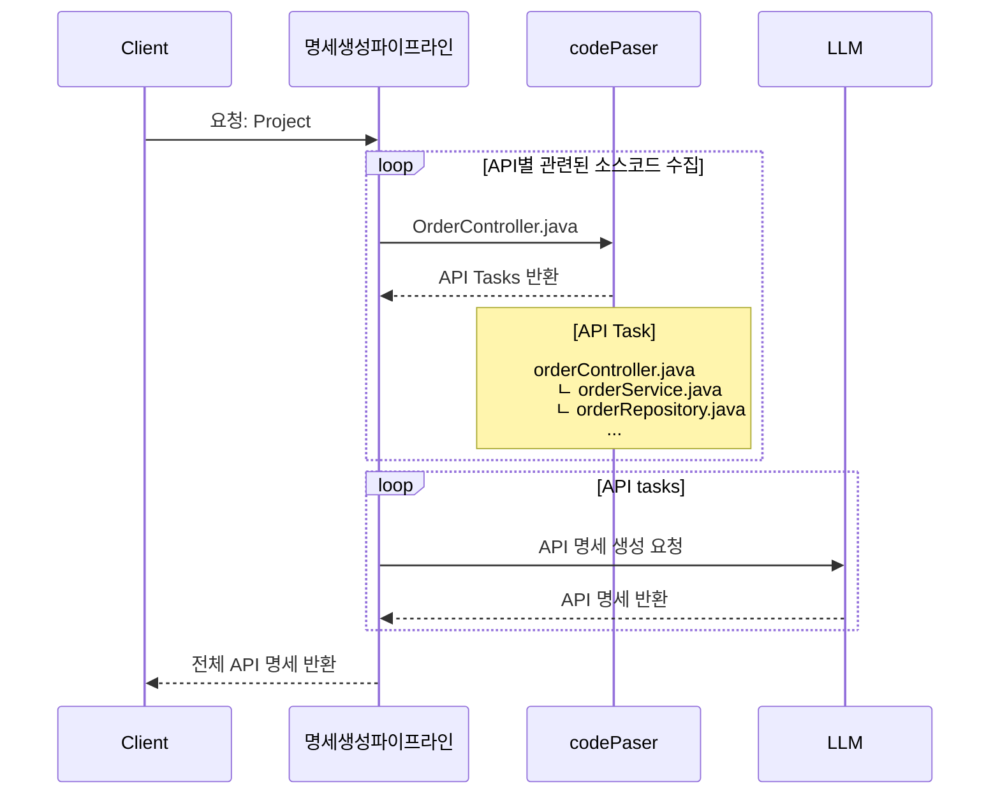
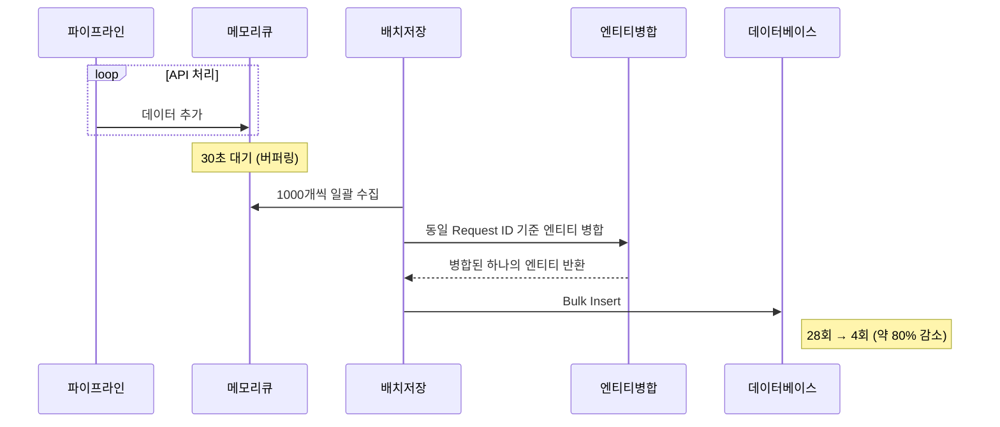
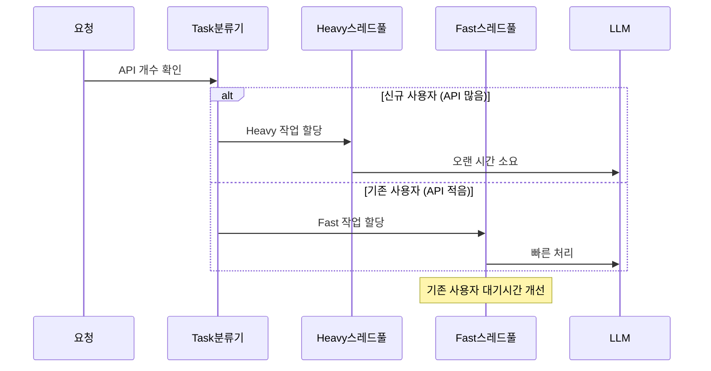

# APIDOC43: API 문서 자동 생성
- 초기 화면 설계
  


**APIDOC43**은 정적 코드 기반 API 문서 생성 서비스입니다.

```
├── api_spec_generator           // OpenAPI 명세 생성 
├── code_parser                  // Java 소스코드 파싱
├── pipline_orchestrator         // 비동기 파이프라인 
└── saas_platform                // 문서관리 API (미개발)
```

---

## API 문서 생성과정

### 시퀀스 다이어그램


## 핵심 구현

### 1. 배치 저장 최적화 (DB I/O 약80% 감소)
```java
@Scheduled(fixedDelay = 30000)
public void flushEntities() { // 30초마다 일괄 저장
    ... 
}
```
**[OasBatchSaverService.java](src/main/java/com/hocs/server/api_spec_generator/service/OasBatchSaverService.java)**
- ArrayBlockingQueue 기반 메모리 버퍼링
- **쿼리 횟수**: 28회 → 4회 
- 재시도 메커니즘과 실패 처리 로직


### 2. 비동기 처리 + 스레드풀 분리 (처리 시간 54% 단축)
```java
// 요청 유형별 스레드풀과 세마포어 분리 관리
public void submit(ThrottleRequest request) {
    Semaphore semaphore = resolver.getRelatedSemaphore(request.getTaskType());
    CompletableFuture.runAsync(() -> pipelineService.execute(task), executor);
}
```
**[PipelineThrottleService.java](src/main/java/com/hocs/server/pipline_orchestrator/ratelimit/PipelineThrottleService.java)**
- **처리 시간**: 202초 → 93초 (54% 단축)
- ThreadPool + Semaphore 기반 동시성 제어
- 신규/기존 사용자 요청 분리 처리로 UX 개선


---

## 기술 스택

- Java 17, Spring Boot 3, JPA 3
- MySQL 8, MongoDB
- Docker, AWS
- OpenAI API, JavaParser

---

## 링크
- 랜딩페이지: https://apidoc43.softr.app/
