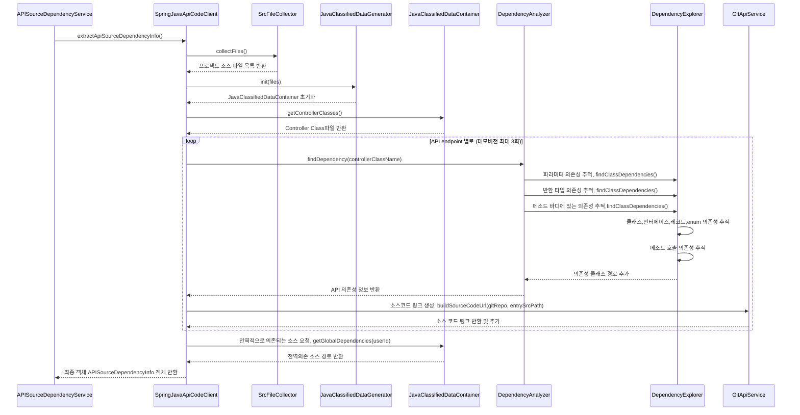
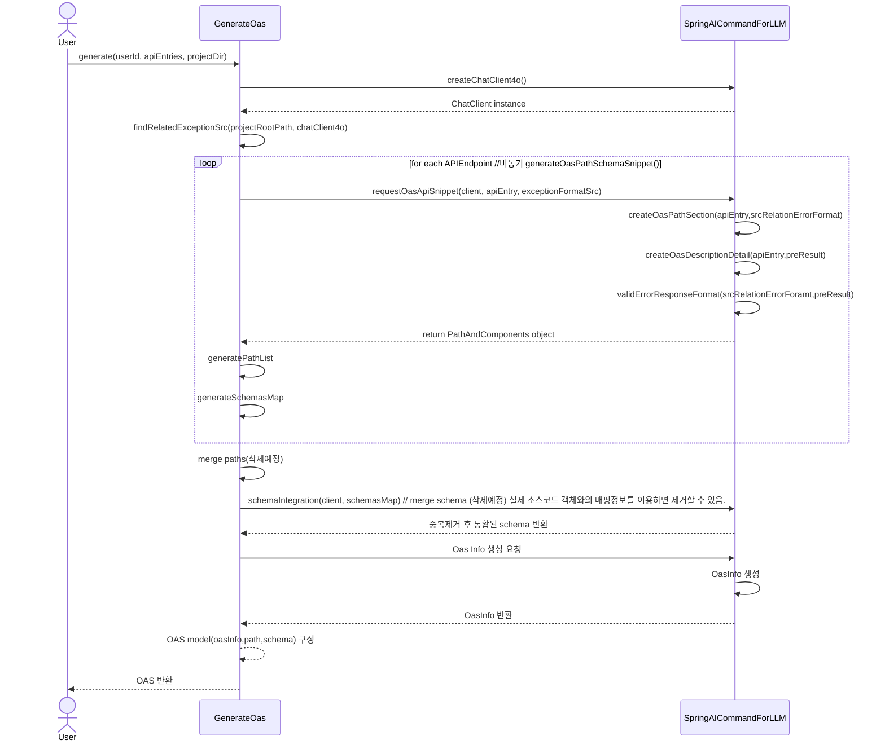

# 회고페이지
[자세히보기](https://steadfast-sofa-4b2.notion.site/1-SW-APIDOC43-15beeae70b85806bbaaffc011f63869f)
---
# 리팩토링 진행중
[자세히 보기](https://steadfast-sofa-4b2.notion.site/30-18beeae70b8581109d36c11ed2adf303)

# APIDOC43: 완전 자동화된 API 문서 솔루션

**APIDOC43**은 개발자의 생산성을 극대화하고 비즈니스 성장에 기여하는 API 문서 자동화 서비스입니다.

---

## **주요 기능**

1. **완전 자동화된 API 문서 생성**
   - 코드 분석을 통해 정확하고 최신의 API 문서를 자동으로 생성합니다.

2. **SaaS 기반 통합 관리 (진행중)**
   - 분산된 API 문서를 손쉽게 통합하고 관리할 수 있습니다.

3. **자연어 검색 (진행예정)**
   - 방대한 API 문서에서 필요한 정보를 쉽게 찾을 수 있습니다.

4. **다양한 분류체계 (진행예정)**
   - 내부용, FE, BE, 관리자 등 다양한 목적의 API를 효율적으로 관리할 수 있습니다.

5. **실시간 업데이트 (진행예정)**
   - 코드 변경 시 자동으로 문서를 최신 상태로 유지합니다.

---

## **기대 효과**
- 개발 생산성 최대 **30% 향상**
- API 문서 작성 및 유지보수 시간 **감소**
- 문서의 **정확성과 일관성 개선**
- 팀 간 **커뮤니케이션 향상**

---
## 파이프라인

---
## 아키텍처

---
## CustomRAG (API 단위 소스코드 추출 모듈) 시퀀스 다이어그램

---
## 문서생성 (LLM - Spring AI) 시퀀스 다이어그램

---
## 프로젝트 관리
[GitHub Project 이용](https://github.com/orgs/APIDOC43/projects/1)
---
## Developer
홍석준 : [@hoding](https://github.com/seokjun7410)

프로젝트 총괄  (기획, 아키텍처 설계, 구현, 마케팅),
- 코드파서 서버 개발(CustomRAG)
- LLM 서버 개발 및 AI 모델 통합 (Spring Boot)
 - SaaS 서버 개발 
- SSG (Static Site Generator) 서버 개발 (Node.js, EJS)
- 클라우드 인프라 구축 및 관리 (AWS)
- 사용자 인터페이스 (UI/UX) 디자인 
- 프로젝트 문서화 및 기술 문서 작성
- 사용자 피드백 수집 및 분석

