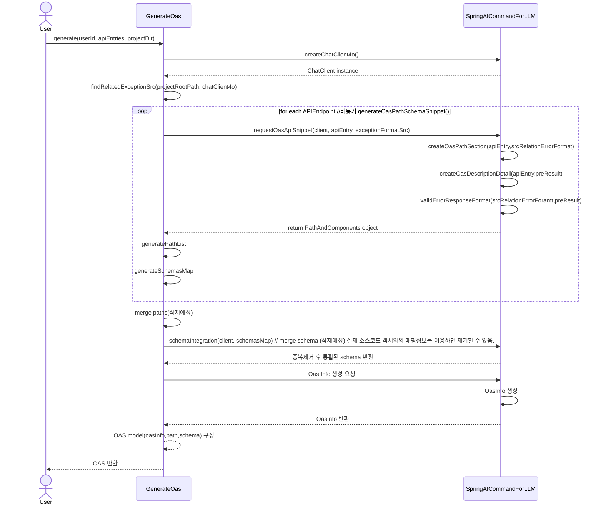

```mermaid
sequenceDiagram
actor User

User ->> GenerateOas: generate(userId, apiEntries, projectDir)
GenerateOas ->> SpringAICommandForLLM: createChatClient4o()
SpringAICommandForLLM -->> GenerateOas: ChatClient instance

GenerateOas ->> GenerateOas: findRelatedExceptionSrc(projectRootPath, chatClient4o)

loop for each APIEndpoint //비동기 generateOasPathSchemaSnippet()
GenerateOas ->> SpringAICommandForLLM: requestOasApiSnippet(client, apiEntry, exceptionFormatSrc)

SpringAICommandForLLM ->> SpringAICommandForLLM: createOasPathSection(apiEntry,srcRelationErrorFormat);
SpringAICommandForLLM ->> SpringAICommandForLLM: createOasDescriptionDetail(apiEntry,preResult);
SpringAICommandForLLM ->> SpringAICommandForLLM: validErrorResponseFormat(srcRelationErrorForamt,preResult);
SpringAICommandForLLM -->> GenerateOas: return PathAndComponents object

GenerateOas ->> GenerateOas: generatePathList
GenerateOas ->> GenerateOas: generateSchemasMap

end

GenerateOas ->> GenerateOas: merge paths(삭제예정);
GenerateOas ->> SpringAICommandForLLM: schemaIntegration(client, schemasMap) // merge schema (삭제예정) 실제 소스코드 객체와의 매핑정보를 이용하면 제거할 수 있음. ;
SpringAICommandForLLM -->> GenerateOas: 중복제거 후 통홥된 schema 반환

GenerateOas ->> SpringAICommandForLLM: Oas Info 생성 요청
SpringAICommandForLLM ->> SpringAICommandForLLM: OasInfo 생성
SpringAICommandForLLM -->> GenerateOas: OasInfo 반환

GenerateOas -->> GenerateOas: OAS model(oasInfo,path,schema) 구성
GenerateOas -->> User: OAS 반환
```