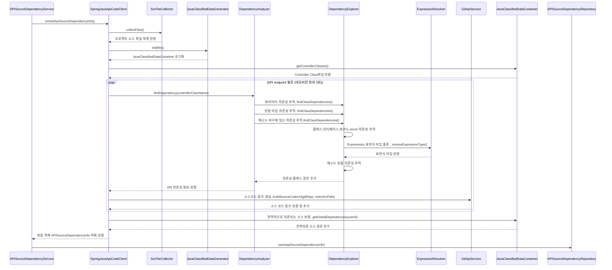

```mermaid
sequenceDiagram
    participant APISourceDependencyService
participant SpringJavaApiCodeClient
participant SrcFileCollector
participant JavaClassifiedDataGenerator
participant DependencyAnalyzer
participant DependencyExplorer
participant ExpressionResolver
participant GitApiService
participant JavaClassifiedDataContainer
participant APISourceDependencyRepository

APISourceDependencyService->>SpringJavaApiCodeClient: extractApiSourceDependencyInfo()
SpringJavaApiCodeClient->>SrcFileCollector: collectFiles()
SrcFileCollector-->>SpringJavaApiCodeClient: 프로젝트 소스 파일 목록 반환
SpringJavaApiCodeClient->>JavaClassifiedDataGenerator: init(files)
JavaClassifiedDataGenerator-->>SpringJavaApiCodeClient: JavaClassifiedDataContainer 초기화
SpringJavaApiCodeClient->>JavaClassifiedDataContainer: getControllerClasses()
JavaClassifiedDataContainer-->>SpringJavaApiCodeClient: Controller Class파일 반환
loop API endpoint 별로 (데모버전 최대 3회)
SpringJavaApiCodeClient->>DependencyAnalyzer: findDependency(controllerClassName)
DependencyAnalyzer->>DependencyExplorer: 파라미터 의존성 추적, findClassDependencies()
DependencyAnalyzer->>DependencyExplorer: 반환 타입 의존성 추적, findClassDependencies()
DependencyAnalyzer->>DependencyExplorer: 메소드 바디에 있는 의존성 추적,findClassDependencies()
DependencyExplorer->>DependencyExplorer: 클래스,인터페이스,레코드,enum 의존성 추적
DependencyExplorer->>ExpressionResolver: Expresssion 표현식 타입 출론 , resolveExpressionType()
ExpressionResolver-->>DependencyExplorer: 표현식 타입 반환
DependencyExplorer->>DependencyExplorer: 메소드 호출 의존성 추적
DependencyExplorer-->>DependencyAnalyzer: 의존성 클래스 경로 추가
DependencyAnalyzer-->>SpringJavaApiCodeClient: API 의존성 정보 반환
SpringJavaApiCodeClient->>GitApiService: 소스코드 링크 생성, buildSourceCodeUrl(gitRepo, entrySrcPath)
GitApiService-->>SpringJavaApiCodeClient: 소스 코드 링크 반환 및 추가
end
SpringJavaApiCodeClient->>JavaClassifiedDataContainer: 전역적으로 의존되는 소스 반환, getGlobalDependencies(userId)
JavaClassifiedDataContainer-->>SpringJavaApiCodeClient: 전역의존 소스 경로 추가
SpringJavaApiCodeClient-->>APISourceDependencyService: 최종 객체 APISourceDependencyInfo 객체 반환
APISourceDependencyService->>APISourceDependencyRepository: save(apiSourceDependencyInfo)

```