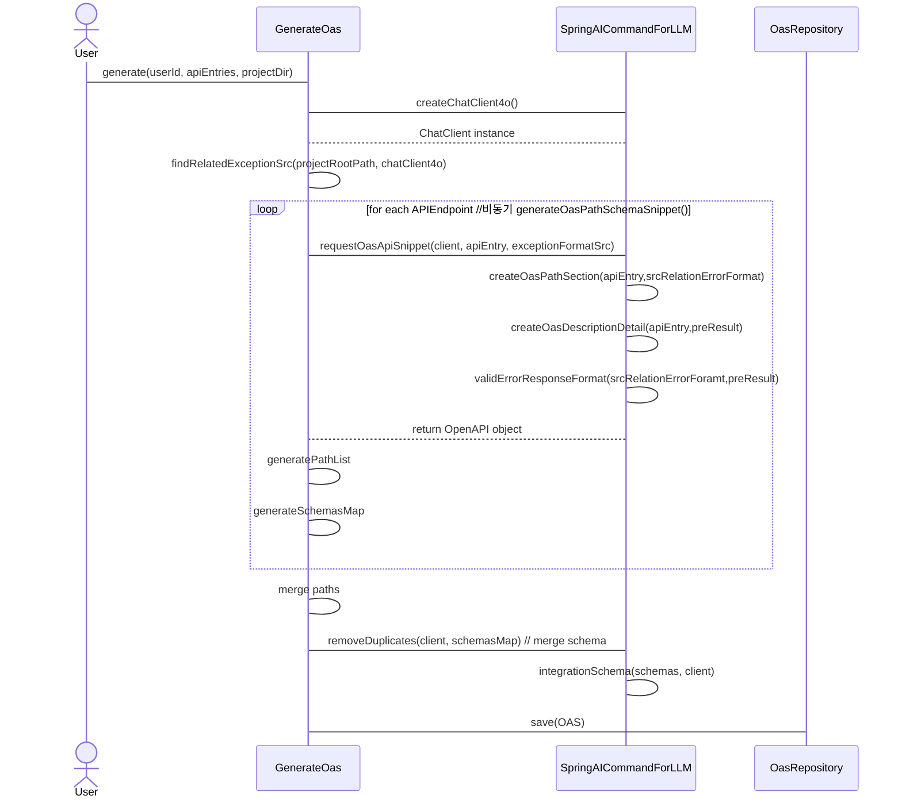

```mermaid
sequenceDiagram
actor User

User -> GenerateOas: generate(userId, apiEntries, projectDir)
GenerateOas -> SpringAICommandForLLM: createChatClient4o()
SpringAICommandForLLM --> GenerateOas: ChatClient instance

GenerateOas -> GenerateOas: findRelatedExceptionSrc(projectRootPath, chatClient4o)

loop for each APIEndpoint //비동기 generateOasPathSchemaSnippet()
GenerateOas -> SpringAICommandForLLM: requestOasApiSnippet(client, apiEntry, exceptionFormatSrc)

SpringAICommandForLLM -> SpringAICommandForLLM: createOasPathSection(apiEntry,srcRelationErrorFormat);
SpringAICommandForLLM -> SpringAICommandForLLM: createOasDescriptionDetail(apiEntry,preResult);
SpringAICommandForLLM -> SpringAICommandForLLM: validErrorResponseFormat(srcRelationErrorForamt,preResult);
SpringAICommandForLLM --> GenerateOas: return OpenAPI object

GenerateOas -> GenerateOas: generatePathList
GenerateOas -> GenerateOas: generateSchemasMap

end

GenerateOas -> GenerateOas: merge paths
GenerateOas -> SpringAICommandForLLM: removeDuplicates(client, schemasMap) // merge schema;
SpringAICommandForLLM -> SpringAICommandForLLM: integrationSchema(schemas, client);

GenerateOas -> OasRepository: save(OAS)


```