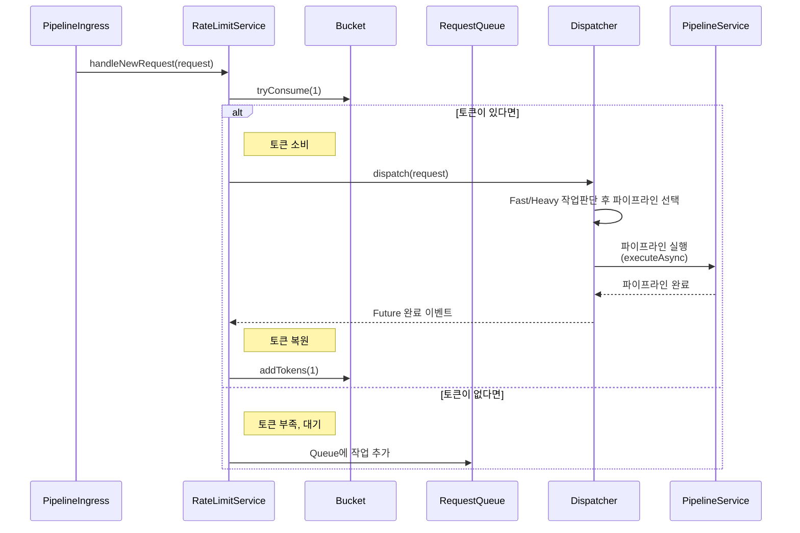

```mermaid
sequenceDiagram
    participant C as PipelineIngress
    participant S as RateLimitService
    participant B as Bucket
    participant Q as RequestQueue
    participant D as Dispatcher
    participant P as PipelineService

    C->>S: handleNewRequest(request)
    S->>B: tryConsume(1)
    alt 토큰이 있다면
        note right of S: 토큰 소비
        S->>D: dispatch(request)
        D->>D: Fast/Heavy 작업판단 후 파이프라인 선택
        D->>P: 파이프라인 실행<br>(executeAsync)
        P-->>D: 파이프라인 완료
        D-->>S: Future 완료 이벤트
        note right of S: 토큰 복원
        S->>B: addTokens(1)
    else 토큰이 없다면
        note right of S: 토큰 부족, 대기
        S->>Q: Queue에 작업 추가
    end

```