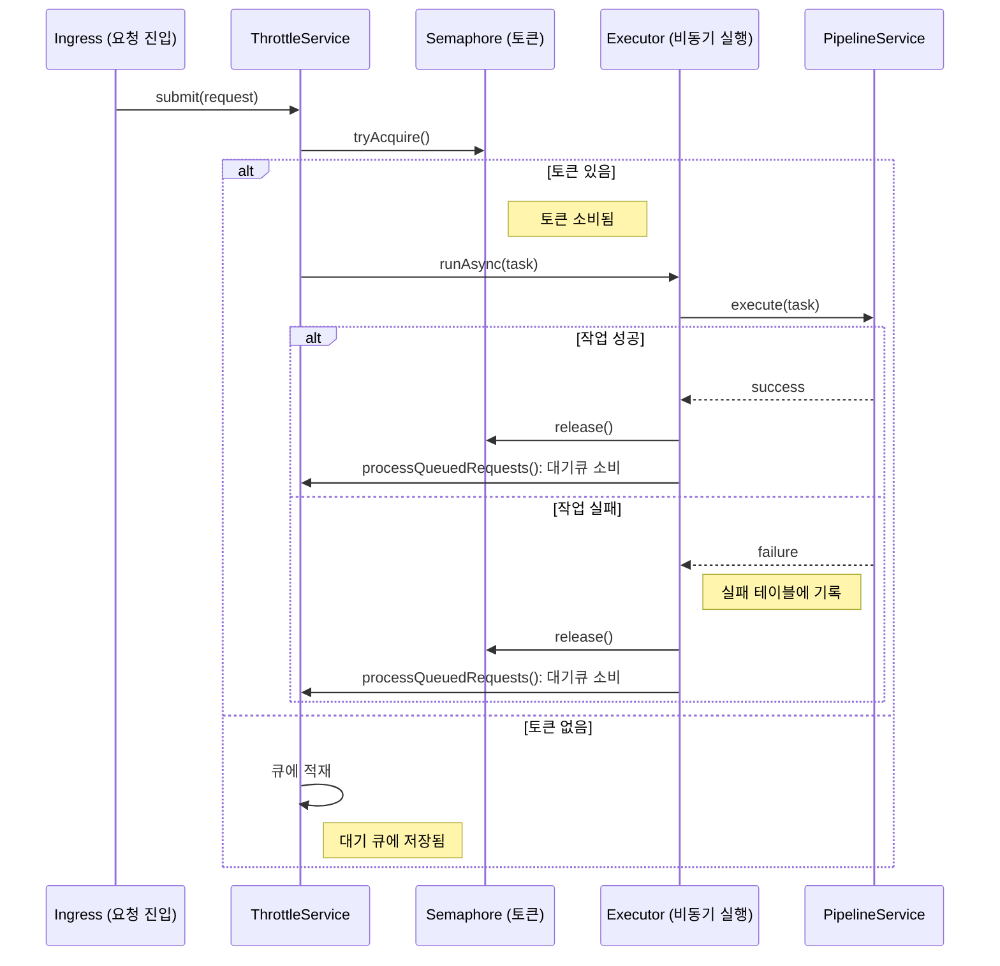

```mermaid
sequenceDiagram
    participant I as Ingress (요청 진입)
    participant T as ThrottleService
    participant S as Semaphore (토큰)
    participant E as Executor (비동기 실행)
    participant P as PipelineService

    I->>T: submit(request)
    T->>S: tryAcquire()
    alt 토큰 있음
        note right of S: 토큰 소비됨
        T->>E: runAsync(task)
        E->>P: execute(task)
        alt 작업 성공
            P-->>E: success
            E->>S: release()
            E->>T: processQueuedRequests(): 대기큐 소비
        else 작업 실패
            P-->>E: failure
            note right of E: 실패 테이블에 기록
            E->>S: release()
            E->>T: processQueuedRequests(): 대기큐 소비
        end
    else 토큰 없음
        T->>T: 큐에 적재
        note right of T: 대기 큐에 저장됨
    end
```